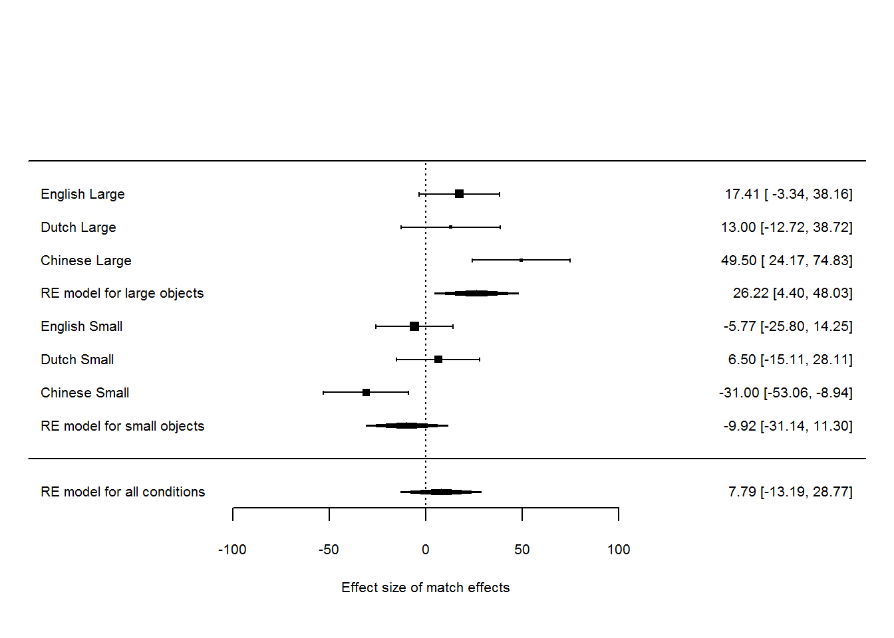

```{r import_data, message=FALSE, warning=FALSE, include=FALSE}

## Import the raw data
From_folder1 <- "D:\\core\\Research\\projects\\Embodied\\EXPDATA\\ActionObject\\2016_Simulation\\EXP\\2016_Orien_Size\\Data\\2016Dec_Critical\\Dutch_Chinese_LAB\\"
From_folder2 <- "D:\\core\\Research\\projects\\Embodied\\EXPDATA\\ActionObject\\2016_Simulation\\EXP\\2016_Orien_Size\\Data\\2016Dec_Critical\\English_MTurk\\"
rawdata_files1 <- list.files(path = From_folder1, pattern = "_rawdata", recursive = TRUE, include.dirs = TRUE)

rawdata_files2 <- list.files(path = From_folder2, pattern = "_rawdata", recursive = TRUE, include.dirs = TRUE)

# Import multiple-bytes string in English system
Sys.setlocale("LC_ALL","English") 

# Import cleaned raw data of verification task
data_TW <- read.csv(file = paste0(From_folder1,rawdata_files1[1]), na.strings = NA)
data_NL <- read.csv(file = paste0(From_folder1,rawdata_files1[2]), na.strings = NA)
data_US <- read.csv(file = paste0(From_folder2,rawdata_files2), na.strings = NA)
data_US$Lang = "E"

## Import the analytic data
DATA_PATH = "D:\\core\\Research\\projects\\Embodied\\EXPDATA\\ActionObject\\2016_Simulation\\EXP\\2016_Orien_Size\\Data\\2016Dec_Critical\\"

# import analytic data
DATA_2IV <- read.csv(paste0(DATA_PATH,"2IV_analytic_data.csv"))
DATA_3IV <- read.csv(paste0(DATA_PATH,"3IV_analytic_data.csv"))

# Make ID as factor
DATA_2IV$ID <- as.factor(DATA_2IV$ID)
DATA_3IV$ID <- as.factor(DATA_3IV$ID)
# Rename labels in List
DATA_2IV$List = gsub("SP_|D_|C_|0|.csv","",DATA_2IV$List)
DATA_3IV$List = gsub("SP_|D_|C_|0|.csv","",DATA_3IV$List)
DATA_2IV$List <- as.factor(DATA_2IV$List)
DATA_3IV$List <- as.factor(DATA_3IV$List)
# Rename labels in Lang 
DATA_2IV$Lang = gsub("E","English",DATA_2IV$Lang)
DATA_2IV$Lang = gsub("C","Chinese",DATA_2IV$Lang)
DATA_2IV$Lang = gsub("D","Dutch",DATA_2IV$Lang)
DATA_3IV$Lang = gsub("E","English",DATA_3IV$Lang)
DATA_3IV$Lang = gsub("C","Chinese",DATA_3IV$Lang)
DATA_3IV$Lang = gsub("D","Dutch",DATA_3IV$Lang)
DATA_2IV$Lang <- as.factor(DATA_2IV$Lang)
DATA_3IV$Lang <- as.factor(DATA_3IV$Lang)
# Rename labels in Size
DATA_2IV$Size = gsub("L","Large",DATA_2IV$Size)
DATA_2IV$Size = gsub("S","Small",DATA_2IV$Size)
DATA_3IV$Size = gsub("L","Large",DATA_3IV$Size)
DATA_3IV$Size = gsub("S","Small",DATA_3IV$Size)
DATA_2IV$Size <- as.factor(DATA_2IV$Size)
DATA_3IV$Size <- as.factor(DATA_3IV$Size)
```

### Hypothesis
In our pre-registered proposal: "Match effects of object orientation in the sentence-picture verification task are consistently smaller than object shape, color, and size. We hypothesize that this may be due to the fact that the orientation objects are small and manipulable.  This study asks the questions if object size constrains object orientation effects, such that effects for smaller, manipulable, items are smaller than for larger, nonmanipulable objects. A pilot study yielded larger match effects for the large objects than for the small objects both in English and in Dutch speakers. In addition, a Bayesian analysis indicated that the stronger match effect occurred for the horizontal objects of English participants and the stronger match effect happened to the vertical objects of Dutch participants. The pre-registered experiment will update the design of sentence-picture verification based on our pilots and test the hypotheses in advance. A third language, Chinese, will be included to test the stronger match effect for the large objects than the small objects and to confirm the inconsistent match effects across horizontal and vertical objects. Alternative recognition trials will be triggered after each eight trials. These recognition trials are used to make sure the participants have paid their attentions on the probe sentences. Meta-analyses will be performed on the data for the three experiments. We expect that effects generalize across languages and therefore that language will not be a signficant moderator of the observed effects."

### Method
#### Participants
The participants came from three langauge backgrounds: English(the United States), Dutch(EUR students), Chinese(Taiwan undergraduates). 150 English participants were the US residents who were recruited from Amazon Mechanical Turk. Every English participant finished the experiment in Qualtrics platform and obtained US\$ 1.5 dollars as the reward. Total 128 valid participants' data (```r sum(data_US$Gender == "Female")/128``` females; averaged age is ```r round(mean(unique(data_US$Age)), 2)``` and the range is ```r paste(min(unique(data_US$Age)),"-",max(unique(data_US$Age)))```) are collected after excluded the participants who met the accidental stop and considered the equal numbers between the stimuli lists.  
The undergraudates in EUR and NCKU participated in the Dutch and Chinese versions in the laboratories of EUR EBL and NCKU LACD Lab. They obtained the course credits or US\$ 2-3 dollars as the reward. ```r length(unique(data_TW$ID))``` Taiwan students (```r sum(data_TW$Gender == "F")/128``` females; averaged age is ```r round(mean(unique(data_TW$Age)), 2)``` and the range is ```r paste(min(unique(data_TW$Age)),"-",max(unique(data_TW$Age)))```) joined the Chinese version. So far, ```r length(unique(data_NL$ID))``` Dutch students (```r sum(data_NL$Gender == "f")/128``` females; averaged age is ```r round(mean(unique(data_NL$Age)), 2)``` and the range is ```r paste(min(unique(data_NL$Age)),"-",max(unique(data_NL$Age)))```) joined the Dutch version. Two Dutch participant are excluded from this analysis because the accuracy score is lower than 80%. We excluded 8 Dutch participants' data because of the pre-registered sample size. The analysis included this participant will be decribed in the footnote of the styled manuscript.  

#### Stimuli and Design
64 sets of critical stimuli are decided by the language backgrounds (English, Dutch, and Chinese), the object size (Large, Small), the object orientation (Horizontal, Verticl), and the matching the probe sentence and target picture(match, mismatch). Half of the sets represent the large objects, and the other half represent the small objects. In each set two pictures show the target object in horizontal and in vertical respectively. The format of target pictures are the grey scaled jpeg files in 240 X 240 pixels. Each picture matches one of the probe sentence whereas mismatches the other probe sentence. Every probe sentence are written in English, Dutch, and Chinese for the participants in the respective langauge backgrounds. The objects are the initial nouns of the probe sentences. We used this sentence strucure according to our earlier pilot study.  

##### Examples of large objects
||Matched Picture|Mismatched Picture|
|---|---|---|
|The canoe was gliding across the river.|||
|The canoe was dropping from the top of the water fall.|||

##### Examples of small objects
||Matched Picture|Mismatched Picture|
|---|---|---|
|The hat was on the model's head.|||
|The hat hung on the wall.|||

64 filler pairs of sentences and pictures are decided for the demand of verification task. In each pair the picture are irrelavent to the sentence. The sentence strucure and the picture format are identical to the critical stimuli.  
  
#### Procedure
The experimental session began after 6 practice trials. Each practice trial is the sentence-picture verification task as identical to the settings of Stanfield and Zwaan(2001) and Zwaan and Pechers (2012). Because the limitations of experimental software, the English participants finished the 6 practices trials with feedback, but the Dutch and Chinese participants finished the pratice session till they correctly answered all the 6 practice trials. 
  
The experimental session had 128 trials of sentence-picture verifiaction task and 30 to 32 trials of the alternative task. For the English participants, the alternative task is the comprehension task follows the settings of Zwaan and Pechers (2012). 32 multiple choices present after 32 fillers. These trials require the participants answer the questions about the probe sentences they just read. For the Dutch and Chinese participants, the alternative task is recognition task as like Stanfield and Zwaan (2001). 30 yes/no problems present randomly between the 128 experimental trials. These problems require the participant recognize if the sentence just shown in the recent three trials or not.  

### Results  
#### Descriptive Analysis
This table summarizes the the median reaction tiems, mean reaction times, and the average accuracy in the function of languages, object size, object orientation, and the matching of sentence and picture. This descriptive analysis and the mixed ANOVA in the next section reveal which variables to be analyzed in the analysis plans. 
```{r summary_3IV, echo=FALSE, message=FALSE, warning=FALSE, results='asis'}
# Take the means and medians for 3 IV
RT_Summary_3IV <- cbind(matrix(unlist( with(data = DATA_3IV,
                                    tapply(RT, paste0(Lang, Size, Orientation, Match), summary)
) ), nc = 6, byrow = TRUE)[,3:4],
round(with(data = DATA_3IV,
     tapply(ACC, paste0(Lang, Size, Orientation, Match), mean)
), digits = 3) )

dimnames(RT_Summary_3IV) <- list(paste(rep(c("C,","D,","E,"),each=8),rep(c("Large Size, Horizontal, Mismatch", "Large Size, Horizontal, Match", "Large Size, Vertical, Mismatch", "Large Size, Vertical, Match", "Small Size, Horizontal, Mismatch", "Small Size, Horizontal, Match", "Small Size, Vertical, Mismatch", "Small Size, Vertical, Match"),3)), c("Median RT", "Mean RT", "Average Accuracy(%)"))
require(xtable)
print(xtable(RT_Summary_3IV), type="html")
```

```{r plot_3IV, eval=FALSE, fig.align='center', message=FALSE, warning=FALSE, cache=TRUE, dependson='import_data', include=FALSE}
require(ggplot2)
# Plot match effects across langauges, object size,  and object orientation
ggplot(DATA_3IV,aes(x=paste(Size,Orientation),y=RT,fill=Match)) + stat_summary(fun.y=median,position=position_dodge(),geom="bar") + coord_cartesian( ylim = c(550, 750) ) + scale_fill_grey(start = 0, end = 0.9) + labs(title = "Match effects of the specific object orientation across object size and langauges", x = "Object size and orientation", y = "Median RTs (in milliseconds)") + theme(panel.background = element_blank(), panel.grid.major.x = element_blank(), panel.grid.minor.x = element_blank(), panel.grid.minor.y = element_blank(), panel.ontop = TRUE)+facet_wrap(~ Lang )
```

This figure illustrates the match effects across object size and languages. The object orientations are merged under each object size.  
```{r plot_2IV, echo=FALSE, message=FALSE, warning=FALSE, fig.align='center', cache=FALSE}
require(ggplot2)
# Take the means and medians for 2 IV
RT_Summary_2IV <- matrix(unlist( with(data = DATA_2IV,
                                      tapply(RT, paste0(Lang, Size, Match), summary)
) ), nc = 6, byrow = TRUE)
RT_Summary_2IV <- cbind(RT_Summary_2IV, SE = with(data = DATA_2IV, tapply(RT, paste0(Lang, Size, Match), sd)
)/sqrt(with(data = DATA_2IV, tapply(RT, paste0(Lang, Size, Match), length))))
RT_Summary_2IV <- data.frame(cbind( cbind(cbind(rep(c("Chinese","Dutch","English"),each=4),rep(c("Large", "Large", "Small", "Small"), 3)), rep(c("N", "Y", "N", "Y"), 3)), RT_Summary_2IV))
dimnames(RT_Summary_2IV) <- list(paste(rep(c("C,","D,","E,"),each=4),rep(c("Large Size, Mismatch", "Large Size, Match", "Small Size, Mismatch", "Small Size, Match"), 3) ), c("Language","Size","Match","Min.", "1st Qu.",  "Median", "Mean", "3rd Qu.", "Max", "SE"))

RT_Summary_2IV$Median <- as.numeric(as.character(RT_Summary_2IV$Median))
RT_Summary_2IV$SE <- as.numeric(as.character(RT_Summary_2IV$SE))

# Plot match effects across langauges and object size
plot_2IV <- ggplot(RT_Summary_2IV,aes(x= Size, y=Median, fill=Match)) + geom_bar(stat = "identity", position = position_dodge()) + coord_cartesian( ylim = c(550, 750)) + labs(y = "Median RT") + scale_fill_grey(start = 0, end = 0.9) + theme_classic() + facet_wrap(~ Language)

plot_2IV + geom_errorbar(aes(ymax = Median + SE, ymin = Median - SE ), width=.2, position = position_dodge(.9))
```

The laboratory studies showed the stronger match effects than the internet study. All the three groups show the match advantage for the large objects. English and Dutch data show the null match effect for the small objects as like the recent studies(De Bjorn, et al., in submission). However, the Chinese data show the mismatch advantage for the small objects.   

#### Primay analysis: ANOVA
In the pre-registered proposal:"A 2 (size) X 2 (orientation) X 2 (match) X 3 (language) mixed ANOVA will be conducted on the participants' median response times. This ANOVA will indicate the match effects interacting with object size, orientation, and languages." 

This analysis told us which variables to be investigated in the analysis plans.  
```{r registered_ANOVA_4IV, echo=FALSE, message=FALSE, warning=FALSE, cache=TRUE,, results="asis"}
require(xtable)
RT_aov_3IV <- xtable(aov( RT ~ Lang*Size*Orientation*Match + Error(ID/(Size*Orientation*Match)), data =DATA_3IV), digits = 3)[1:23,]
print(RT_aov_3IV, type = "html")
```

In addition to the main effect of object size, ```r paste0("F(",RT_aov_3IV[3,1],",",RT_aov_3IV[5,1],") = ",round(RT_aov_3IV[3,4],digits = 2),", MSE = ", round(RT_aov_3IV[5,3],digits = 2),", p = ",round(RT_aov_3IV[3,5],digits = 3))```, the main effects of the other three independent variables do not reach the statistical significant level (p > .05). Between the two-way interactions, only the interaction of object size and match effects was beyond the statistical significant level, ```r paste0("F(",RT_aov_3IV[15,1],",",RT_aov_3IV[17,1],") = ",round(RT_aov_3IV[15,4],digits = 2),", MSE = ", round(RT_aov_3IV[17,3],digits = 2),", p = ",round(RT_aov_3IV[15,5],digits = 3))```. Between the three-way interactions, only the interaction of object size, orientation, and match effects was beyond the statistical significant level, ```r paste0("F(",RT_aov_3IV[21,1],",",RT_aov_3IV[23,1],") = ",round(RT_aov_3IV[21,4],digits = 2),", MSE = ", round(RT_aov_3IV[23,3],digits = 2),", p = ",round(RT_aov_3IV[21,5],digits = 3))```. Participants' response times obviously increased with the object size, and the match advantages/disadvantages changed between the object size. The object orientation moderated the match effects across the object size, but the main effect is weak. At last, there are no significant differences of participants' responses among the three languages.    

The four-way mixed ANOVA indicates the object orientations could be merged. We conducted the three-way mixed ANOVA to confirm the significant main effect and interaction.   

```{r registered_ANOVA_3IV, echo=FALSE, message=FALSE, warning=FALSE, cache=TRUE, results="asis"}
require(xtable)
RT_aov_2IV <- xtable(aov( RT ~ Lang*Size*Match + Error(ID/(Size*Match)), data =DATA_2IV), digits = 3)[1:11,]
print(RT_aov_2IV, type = "html")
```

The three-way ANOVA shows the significant main effect of object size, ```r paste0("F(",RT_aov_2IV[3,1],",",RT_aov_2IV[5,1],") = ",round(RT_aov_2IV[3,4],digits = 2),", MSE = ", round(RT_aov_2IV[5,3],digits = 2),", p = ",round(RT_aov_2IV[3,5],digits = 3))```, but the interaction of size and match effect turns out marginal, ```r paste0("F(",RT_aov_2IV[9,1],",",RT_aov_2IV[11,1],") = ",round(RT_aov_2IV[9,4],digits = 2),", MSE = ", round(RT_aov_2IV[11,3],digits = 2),", p = ",round(RT_aov_2IV[9,5],digits = 3))```.  

##### Brief discussion on the analysis of response times  
From the four-way ANOVA to the three-way ANOVA, the interaction of language, size, and match turns out significant after the orientations were merged. This demonstrates the match effects of Chinese being dissimilar to those of English and Dutch. 

A mixed four-way ANOVA is conducted on the accuracy data.  
```{r registered_ANOVA_3IV_ACC, echo=FALSE, message=FALSE, warning=FALSE, cache=TRUE, results="asis"}
require(xtable)
ACC_aov_3IV <- xtable(aov( ACC ~ Lang*Size*Orientation*Match + Error(ID/(Size*Orientation*Match)), data =DATA_3IV), digits = 3)[1:23,]
print(ACC_aov_3IV, type = "html")
```  

##### Brief discussion on the analysis of accuracy  
The Chinese participants made more incorrect responses for the mismatched items of the small objects than the other two groups. This may cause the significant main effect of match effect, ```r paste0("F(",ACC_aov_3IV[9,1],",",ACC_aov_3IV[11,1],") = ",round(ACC_aov_3IV[9,4],digits = 2),", MSE = ", round(ACC_aov_3IV[11,3],digits = 2),", p = ",round(ACC_aov_3IV[9,5],digits = 3))```, and the significant interaction of language and object size, ```r paste0("F(",ACC_aov_3IV[3,1],",",ACC_aov_3IV[5,1],") = ",round(ACC_aov_3IV[3,4],digits = 2),", MSE = ", round(ACC_aov_3IV[5,3],digits = 2),", p = ",round(ACC_aov_3IV[3,5],digits = 3))```. The performances of Chinese participants also caused the interaction of languages, object orientations, and match effects marginal (p = .07).  
  
#### Primay analysis: Meta-analysis
In the pre-registered proposal: "A meta-analytic effect size of the match effects across languages, size, and orientation will be summarized. This meta-analysis will confirm that the match effects could shift with the object size and orientations but have a stable pattern across languages."  
  
In this meta analysis, the effect size of match effects for each object size are calculated based on participants' median RT and standardize deviation. . The intervals represent the match advantage/disadvantage estimated by the difference of medians.  
```{r regisgered_meta01, echo=FALSE, fig.align="center", message=FALSE, warning=FALSE, cache=TRUE, results="asis"}
require(metafor)
## Create data set for escalc()
dat_2IV = data.frame(
condition = unique(with(data = DATA_2IV, paste(Lang, Size))),
m_match = as.vector( with(data = subset(DATA_2IV, Match == "Y"), tapply(RT, paste(Lang,Size),median) ) ),
m_mismatch = as.vector( with(data = subset(DATA_2IV, Match == "N"), tapply(RT, paste(Lang,Size),median) ) ),
sd_match = as.vector( with(data = subset(DATA_2IV, Match == "Y"), tapply(RT, paste(Lang,Size),sd) ) ),
sd_mismatch = as.vector( with(data = subset(DATA_2IV, Match == "N"), tapply(RT, paste(Lang,Size),sd) ) ),
ni = as.vector( with(data = subset(DATA_2IV, Match == "Y"), tapply(ID, paste(Lang,Size), length) ) ),
ri = rep(.5,6)
)
## Calculate effect size of 12 conditions
dat_2IV_es <- escalc(measure = "MC", m1i = m_mismatch, m2i = m_match, sd1i = sd_mismatch, sd2i = sd_match, ni = ni, ri = ri, slab = condition, data = dat_2IV)
## Do the meta analysis on 12 conditions, in random effect model
dat_2IV_meta <- rma.uni(yi, vi, data = dat_2IV_es, slab = condition, method = "REML", digits = 2)
## Draw the main forest plot for all conditions and overall meta-analytical effect
forest(dat_2IV_meta, cex = .65, ylim = c(-1, 11), order = c(1,3,5,2,4,6), rows = c(6:8,2:4), xlab = "Effect size of match effects", mlab = "RE model for all conditions")

## Do the meta analysis on the large objects in random effect model
dat_2IV_large_meta <- rma.uni(yi, vi, data = dat_2IV_es[c(1,3,5),], slab = condition, method = "REML", digits = 2)
## Do the meta analysis on the small objects, in random effect model
dat_2IV_small_meta <- rma.uni(yi, vi, data = dat_2IV_es[c(2,4,6),], slab = condition, method = "REML", digits = 2)
## Draw the meta-analytical effect of large objects on the main forest plot
addpoly(dat_2IV_large_meta, row = 5, cex = .65, mlab = "RE model for large objects")
## Draw the meta-analytical effect of small objects on the main forest plot
addpoly(dat_2IV_small_meta, row = 1, cex = .65, mlab = "RE model for small objects")
```

The meta analysis of random-effect model indicates the match advantage for the large objects. The forest plot indicats the contribution of Chinese data to the overall match advantage. As for the small objects, the mismatch advantage of Chinese data decreases the overall match effect. The Dutch data shows the pattern of match advantage for the small objects. However, this pattern was implicit in the forest plot at 2017, Jan.




This old forest plot shows the Dutch match advantage of small objects approched zero and the Dutch match advantage of large objects was as large as the English data. Although the overall match effects of large (14.07) and small objects (-22.75) are like the old data (26.22 and -31.00), these differences show the different patterns between language groups yet to detected before the sample size reached the pre-registered numbers. 

[//]: # "The standard effect size of match effects were estimated in the function of languages, object size, and object orientation. The meta-analytic effects were estimated in the convergence of the orientation and the size. The  match advantage of the large and vertical objects was indicated by the meta-analytic effect. These objects further contributed to the match advantage of large objects. The small objects shows the null effect but tends to the match disadvantage. After the Dtuch data accumulated beyond 50 participants, the match effect of small objects will be confirmed."    

[//]: # "In the meta analysis #2, the by-participant match effects are calculated in the function of languages and object size. The by-pariticipant match effect are estimated by the pooling variance given each participant. These data are the devpendent variable of the meta-regression. The funnel plot illustrates the random variation of the individual match effects. Every point represent the individual responses for the large or small objects. The meta-regression models are computed in accordance with the combinations of participants' error and the two indevependent variables, languages and object size."   

#### Secondary analysis: Bayesian Statistics
In the pre-registered proposal: "We calculate Bayes factor of each match effect as the evidence resulted from the given object size, orientation, and the participants' native language."   

###### Bayes Factors

We run the one-tailed Baysian t test for the six sets of match effects. The Bayes factors that favored the match advantage (BFplus0) and the mismatch advantage (BF0plus) are calculated.  
```{r registered_Bayes, echo=FALSE, message=FALSE, warning=FALSE, fig.align="center", results="asis"}
## Compute Bayes Factor
require(BayesFactor)
require(dplyr)
require(xtable)
## Compute Bayes Factor of match effects
BF.dat <- NULL
BF.name <- NULL
for(i in with(data = DATA_2IV, unique(paste0(Lang,"_",Size))) ){
        BF.dat <- c(BF.dat, extractBF(ttestBF( unlist( select( filter(DATA_2IV, Lang == unlist(strsplit(i, "_"))[1], Size == unlist(strsplit(i, "_"))[2], Match == "N"), RT) ), unlist(select( filter(DATA_2IV, Lang == unlist(strsplit(i, "_"))[1], Size == unlist(strsplit(i, "_"))[2], Match == "Y"), RT) ), paired = TRUE, nullInterval=c(0, Inf) ) )$bf )
        BF.name <- c(BF.name, i)
}
BF.table <- xtable( data.frame(dataset = BF.name, BFplus0 = BF.dat[seq(1,12,by=2)], BF0plus = BF.dat[seq(2,12,by=2)]))

print(BF.table, type="html")
```

When the prior is 0.707, Bayes factors show the strong evidence for the match advantage of English, large object size and for the match disadvantage of Chinese, small object size. These evidences show the information in terms of the mean reaction times.    

Because the Bayes Factors for each condition are calculated in terms of the mean reaction times, we run the Baysian meta-analytic t tests (Rouder and Morey, 2011) for the data of large objects and small objects respectively. The t tests for each language group are summarized by the difference of the median RTs and the sampling variance of each condition.    
```{r Bayesian_meta, echo=TRUE, message=FALSE, warning=FALSE}
## Preparte the Bayesian meta t statistics
raw_t <- dat_2IV_es$yi/sqrt(dat_2IV_es$vi)
raw_n <- dat_2IV_es$ni
## Meta-analytic BF for Large Objects
extractBF(meta.ttestBF(t=raw_t[c(1,3,5)], n1=raw_n[c(1,3,5)], nullInterval = c(0, Inf), rscale = 1))$bf[1]
## Meta-analytic BF for Small Objects
extractBF(meta.ttestBF(t=raw_t[c(2,4,6)], n1=raw_n[c(2,4,6)], nullInterval = c(-Inf,0), rscale = 1))$bf[1]
```

[//]: # "THe large objects across the three languages show a strong evidence, BF+0 = 33.99, but the small objects show a neglectable evidence, BF0+ = 0.25."

##### BF models

To make sure the interaction of object size and match effects, the models contained 'Size:Match' are analyzed by Bayesian ANOVA. In the data for the forest plot, there are four models (see below) have 'Size:Match'. The Bayes Factors of this interaction are calculated based on the demonstration of Rouder, Engelhardt, McCabe, & Morey (2016). The prior (r scale) for the fixed effects is 0.5, and the prior for the random effect (by subject variations) is 1. The interaction of object size and match effects is embedded in the four models as following.

```{r registered_BF01, echo=TRUE, message=FALSE, warning=FALSE}
require(BayesFactor)
load("bf_2IV.RData")
## Numerator: Size + Match + Size:Match + ID
## Denominator: Size + Match + ID
extractBF(bf_2IV[13]/bf_2IV[7])$bf
## Numerator: Lang + Size + Match + Size:Match + ID
## Denominator: Lang + Size + Match + ID 
extractBF(bf_2IV[14]/bf_2IV[8])$bf
## Numerator: Lang + Size + Lang:Size + Match + Size:Match + ID
## Denominator: Lang + Size + Lang:Size + Match + ID
extractBF(bf_2IV[15]/bf_2IV[9])$bf
## Numerator: Lang + Size + Match + Lang:Match + Size:Match + ID
## Denominator: Lang + Size + Match + Lang:Match + ID
extractBF(bf_2IV[16]/bf_2IV[11])$bf
```

This data set is seperated to the set of large objects and the set of small objects. The analysis shows the larger Bayes Factor for the large objects. However, neither large objects nor small objects have the Bayes Factor > 1.

```{r registered_BF02, echo=TRUE, message=FALSE, warning=FALSE}
require(BayesFactor)
## Large objects
extractBF(bf_2IV_Large[3]/bf_2IV_Large[1])$bf
## Small objects
extractBF(bf_2IV_Small[3]/bf_2IV_Small[1])$bf
```

The comparisons between models indicate the object size has the largest accountibility for the match effects. This is consistent with the meta-analytical effects that the large objects show the significant match advantage, and the small objects show the tendency of mismatch advantage.  
  
#### Secondary analysis: Changes among stimuli lists
In the pre-registered proposal: "A participant will be assigned one of the four stimulus lists due to the counter-balanced within-participant conditions. A mixed ANOVA including the list as the independent variable will confirm its insignificant affection on the participants' responses."  
```{r registered_Lists, message=FALSE, warning=FALSE, cache=TRUE, include=FALSE, results="asis"}
require(xtable)
RT_aov_3IV_list <- with(data = DATA_3IV,
                 xtable(aov(RT ~ Lang*List*Size*Orientation*Match + Error(ID/(Size*Orientation*Match) ) ))   )[c(2:39),]
print(RT_aov_3IV_list, type = "html")
```

The 4-way repeated measurement ANOVA shows the null effect of the stimuli lists, F < 1. There was no interaction of stimuli lists and the language groups as well, ```r paste0("F(",RT_aov_3IV_list[2,1],",",RT_aov_3IV_list[3,1],") = ",round(RT_aov_3IV_list[2,4],digits = 2),", MSE = ", round(RT_aov_3IV_list[3,3],digits = 2),", p = ",round(RT_aov_3IV_list[2,5],digits = 3))```. On the ohter hand, the stimuli lists interacted with the object size, ```r paste0("F(",RT_aov_3IV_list[6,1],",",RT_aov_3IV_list[8,1],") = ",round(RT_aov_3IV_list[6,4],digits = 2),", MSE = ", round(RT_aov_3IV_list[8,3],digits = 2),", p = ",round(RT_aov_3IV_list[6,5],digits = 3))```, and the match effect, ```r paste0("F(",RT_aov_3IV_list[16,1],",",RT_aov_3IV_list[18,1],") = ",round(RT_aov_3IV_list[16,4],digits = 2),", MSE = ", round(RT_aov_3IV_list[18,3],digits = 2),", p = ",round(RT_aov_3IV_list[16,5],digits = 3))```.  

#### Secondary analysis: Comprehension and Recognition task
In the pre-registered proposal: "The average accuracies of the recognition trails and the comprehension task will be summarized by the participant. The average accuracy of every language group is compared to 50% which assume the participant had not read the probe sentence carefully. In the laboratory experiment, thirty recognition trials randomly present between the experimental trails. In the internet experiment, 32 comprehension trials present after the filler items."

```{r registered_task, echo=FALSE, message=FALSE, warning=FALSE, results="asis"}
require(xtable)
TEST_Results <- unlist( with(filter(DATA_3IV, Size == "Large", Orientation == "H", Match == "Y"), tapply(MEM_ACC, Lang, t.test, mu=50, alternative = "greater")))
TEST_Table <- xtable(matrix(as.numeric(TEST_Results[grep("statistic.t|df|p.value|estimate.mean",names(TEST_Results))]),nc=4, byrow = TRUE, dimnames = list(c("Chinese","Dutch","English"),c("t","df","p value","Averaged Accuracies(%)")))[,c(4,1:3)], digits=2)
print(TEST_Table, type="html")
```     

Each group of participants complete the second task in the accuracies significantly higher than 50%.   

### Discussion: Comfirmatory Analysis
In the beginning of our pre-registered plan, "we expect that (match) effects generalize across languages and therefore that language will not be a signficant moderator of the observed effects." The current results show the match effects changed among the three languages. The meta-analytical effect of small objects is consistent with the weak match advantage in the past studies. Among the three language groups, the Dutch data showed the tendency of match advantage. On the other hand, the meta-analytical effect of large objects confirms the findings in our pilot studies ([English pilot data](https://osf.io/av9p6/) and [Dutch pilot data](https://osf.io/s9mc9/)). The Chinese data contributed the largest effect to this overall effect, but the Dutch data showed the null effect. 

### Discussion: Exploratory Analysis

The meta analysis shows the interaction of object size and match effects, but the Bayesian statistics tend to falsify this interaction. The moderator of language shows the larger impact than our expect. During the data collection and analysis, we have considered some directions to be explored. 

At March 1st, Rolf suggested "We can simply run a perception experiment in which people see a picture of an object and then another picture their task is to say whether it's the same object. We should then expect a bigger orientation effect for the nonmanipulable objects than for the manipulable ones. So basically this is the same experiment but with sentences replaced with pictures." 

After the data collection was completed, I suggested the alternative hypothesis: " I am curious if the participants "remembered" the probe sentences in different strategies? The English participants are not considered in this question because they run the comprehension task rather than the recognition task in the laboratories. The probe sentences imply the object orientation in some background, but the target pictures show the objects without any context information. What if Taiwan participants tended to remember the background of large objects, but Dutch participants preferred the context of small objects? This question would lead to the new hypothesis that the language could guide the individual attentions to the objects and the background."

When I was updating this handout, the precise version of my hypothsis came to my mind. We could expect that the participants have the visual simulation of the scene when the comprehended the probe sentence. This scene illustrates the object in the background implied by the sentence. If the participants' attentions to the object and to the background are varied among the languages, the evaluation performance could be different among the language users. This hypothesis has the support of the eye-movement study on the scene perception(Nisbett & Miyamoto 2005).  

[//]: # "Alternative analysis: By-item accuracy"
[//]: # "To evaluate the language bias, we summarized the by-item accuracy for each data set. In use of the 80% as the criteria, we found 10 of 192 items are low accurate for English participants; 16 of 192 items are low accurate for Dutch participants; 26 of 192 items are low accurate for Chinese participants. This may imply that the Chinese participants are unfamiliar with more the objects than English and Dutch participants. The details will be described in the appendix of the manuscript." 

[//]: # "##### Why match effects of object orientation change?" 
[//]: # "1. Large objects are able generate the match advantage across the three language groups. Small objects fail to cause the match effects, but there was a match disadvantage happened to the Chinese participants.   2. In the pilot study, [English participants](https://osf.io/sre3m/) and [Dutch participants](https://osf.io/6w3kn/) tended to show the match advantages of the large objects and the match disadvantages of the small objects. The critical study indicates this pattern although the meta-analysis and Bayes factors show the different pictures. The meta-analysis reveals the contribution of the Chinese participants because this analysis used the median RTs as the dependent measurement. The Bayes factors reveals the larger match advantage for the English participants because this analysis used the mean RTs as the dependent measurement. As for the small objects, both the meta-analysis and the Bayes factors indicate the match disadvantage of the Chinese participants.   3. Question 1: Is there the primary factor caused the match advantage of large objects and the mismatch advantage of small objects? If people are easier simulated the visaul image of large objects than the small objects, they have the response advantage for the large objects presented in the typical orientation. This brings two testable hypotheses: (1) Visual similuation of large objects is more efficient than that of small objects; (2) Large objects are easier simulated in the typical orientation. To test the first hypothesis, we could design the between-participant study in which one group have the large and small objects but the other group have only the small objects. To test the second hypothesis, We may need to build the norm that classify the typtical orientation of the large objects.   4. Question 2: Why do the Chinese participants show the mismatch advantage for the small objects? Taiwanese started reading and writing in the vertical direction. They may be used to imagine the visual appearance with the vertical text. Although many adult Taiwanese are used to vertical and horizontal orientation, their reading experience may enhance the implied object shape. We could compare the match effects of small objects in the horizontal reading direction and in the vertical reading direction. If the vertical reading direction could help Taiwanese imagine the object shape, it could show the match advantage in the vertical direction rather than the horizontal direction. The replications of classical orientation studies (Stanfield and Zwaan ,2001; Zwaan and Pecher, 2012) could test this hypothesis."
