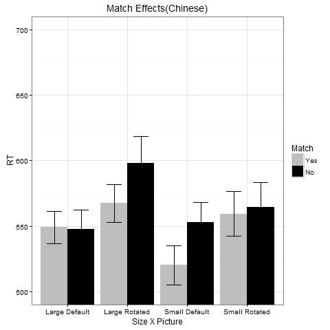
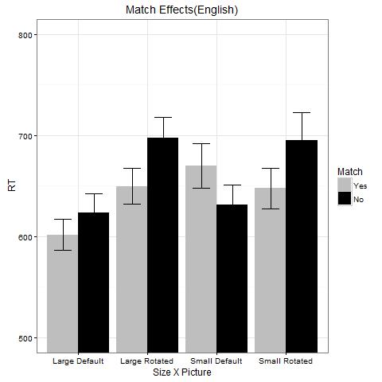

Explore Match Effect of Orientation
========================================================
## Sau-Chin Chen

## Match Effect of Orientation: Due at 2016/4/28
- Particiapnts: 20 Taiwan undergraduates, 25 EUR undergraduates
- Procedure: identical to Zwaan & Pecher (2012)
- Variables:  
Langauge (Chinese, English)  
Size of Object (Large, Small)  
Orientation of Object (Default = original picture, Rotated = modified picture)  
Match(Yes, No)

## Why manipulate Language?
- To test generality of match effect

## Why manipulate Size of Object?
|Study |Total Objects |# of large objects |Note |Effect |
|:------:|:----------:|:-----:|:-------------:|:---:|
|Stanfield and Zwaan (2001)|24|1|wheel|Facilitation |
|Zwaan, Stanfield, and Yaxley (2002)|28|4|airplane, sailboat, eagle, hockey player|Facilitation |
|Connell (2007)|12|5|traffic light, tree, bear, lamb, sky|Inhibition |
|Zwaan and Pecher, (2012)|24,28,24|10|Replication of three studies|Facilitation |
|Pecher, van Dantzig, Zwaan, and Zeelenberg(2009)|52(O) + 40(S)|8|airplaneground, caruse, dooruse, hockeyplaying, gasuse, gitaarh, sailboatnosails, suitcaseuse |Facilitation |
|Rommers, Meyer, and Huettig, (2013)|52(O) + 40(S)|8|From PDZ & Z(2009); Used across three tasks|No(for naming) |

## Why manipulate Orientation of Object?
- Top in literatures
- Large sample size: 40 to 172
- High standard errors: 200 to 382
- Probe sentence describes a complex situation:  
`Frank placed the iron onto the shelf, hoping he wouldn't be late.`  
`Becca used the scissors to carve her initials into the wet concrete.`  

## Example of Large Object 
|Sentences|Match|Dismatch|
|---|---|---|
|I see the empty bathtub.(Default)|</img>|</img>|
|I see the falling bathtub.(Rotated)|</img>|</img>|

## Example of Small Object
|Sentences|Match|Dismatch|
|---|---|---|
|I see the key chain left on the table.(Default)|</img>|</img>|
|I see the key chain hanged on the wall.(Rotated)|</img>|</img>|

## Questions to be addressed
1. Large objects will cause larger match effect of orientation than small objects.
2. Size of object is independent from orientation of object.
3. Simple sentence structure will result in the significant match effects in a samller sample size (n < 30).

## Chinese: Descriptive analysis

</img>

<!-- html table generated in R 3.3.0 by xtable 1.8-2 package -->
<!-- Thu May 19 11:16:51 2016 -->
<table border=1>
<tr> <th>  </th> <th> Size </th> <th> Pic </th> <th> Match </th> <th> RT_MEAN </th> <th> RT_SD </th> <th> ACC_MEAN </th> <th> ACC_SD </th>  </tr>
  <tr> <td align="right"> 1 </td> <td> Large </td> <td> Default </td> <td> No </td> <td align="right"> 547.94 </td> <td align="right"> 65.26 </td> <td align="right"> 95.50 </td> <td align="right"> 6.05 </td> </tr>
  <tr> <td align="right"> 2 </td> <td> Large </td> <td> Default </td> <td> Yes </td> <td align="right"> 549.03 </td> <td align="right"> 54.31 </td> <td align="right"> 97.50 </td> <td align="right"> 4.44 </td> </tr>
  <tr> <td align="right"> 3 </td> <td> Large </td> <td> Rotated </td> <td> No </td> <td align="right"> 598.27 </td> <td align="right"> 89.56 </td> <td align="right"> 96.00 </td> <td align="right"> 6.81 </td> </tr>
  <tr> <td align="right"> 4 </td> <td> Large </td> <td> Rotated </td> <td> Yes </td> <td align="right"> 567.41 </td> <td align="right"> 63.69 </td> <td align="right"> 94.00 </td> <td align="right"> 7.54 </td> </tr>
  <tr> <td align="right"> 5 </td> <td> Small </td> <td> Default </td> <td> No </td> <td align="right"> 552.92 </td> <td align="right"> 68.88 </td> <td align="right"> 95.50 </td> <td align="right"> 6.86 </td> </tr>
  <tr> <td align="right"> 6 </td> <td> Small </td> <td> Default </td> <td> Yes </td> <td align="right"> 520.22 </td> <td align="right"> 66.35 </td> <td align="right"> 94.00 </td> <td align="right"> 6.81 </td> </tr>
  <tr> <td align="right"> 7 </td> <td> Small </td> <td> Rotated </td> <td> No </td> <td align="right"> 564.66 </td> <td align="right"> 84.41 </td> <td align="right"> 95.50 </td> <td align="right"> 8.26 </td> </tr>
  <tr> <td align="right"> 8 </td> <td> Small </td> <td> Rotated </td> <td> Yes </td> <td align="right"> 559.43 </td> <td align="right"> 75.50 </td> <td align="right"> 92.50 </td> <td align="right"> 7.86 </td> </tr>
   </table>

## Chinese: ANOVA
<!-- html table generated in R 3.3.0 by xtable 1.8-2 package -->
<!-- Thu May 19 11:16:51 2016 -->
<table border=1>
<tr> <th>  </th> <th> Df </th> <th> Sum Sq </th> <th> Mean Sq </th> <th> F value </th> <th> Pr(&gt;F) </th>  </tr>
  <tr> <td> Residuals </td> <td align="right"> 19 </td> <td align="right"> 539653.49 </td> <td align="right"> 28402.82 </td> <td align="right">  </td> <td align="right">  </td> </tr>
  <tr> <td> Size      </td> <td align="right"> 1 </td> <td align="right"> 10700.71 </td> <td align="right"> 10700.71 </td> <td align="right"> 6.18 </td> <td align="right"> 0.0224 </td> </tr>
  <tr> <td> Residuals1 </td> <td align="right"> 19 </td> <td align="right"> 32878.72 </td> <td align="right"> 1730.46 </td> <td align="right">  </td> <td align="right">  </td> </tr>
  <tr> <td> Orientation </td> <td align="right"> 1 </td> <td align="right"> 35791.15 </td> <td align="right"> 35791.15 </td> <td align="right"> 30.13 </td> <td align="right"> 0.0000 </td> </tr>
  <tr> <td> Residuals   </td> <td align="right"> 19 </td> <td align="right"> 22571.33 </td> <td align="right"> 1187.96 </td> <td align="right">  </td> <td align="right">  </td> </tr>
  <tr> <td> Match     </td> <td align="right"> 1 </td> <td align="right"> 11462.52 </td> <td align="right"> 11462.52 </td> <td align="right"> 4.45 </td> <td align="right"> 0.0485 </td> </tr>
  <tr> <td> Residuals2 </td> <td align="right"> 19 </td> <td align="right"> 48990.24 </td> <td align="right"> 2578.43 </td> <td align="right">  </td> <td align="right">  </td> </tr>
  <tr> <td> Size:Orientation </td> <td align="right"> 1 </td> <td align="right"> 789.22 </td> <td align="right"> 789.22 </td> <td align="right"> 0.59 </td> <td align="right"> 0.4508 </td> </tr>
  <tr> <td> Residuals        </td> <td align="right"> 19 </td> <td align="right"> 25296.27 </td> <td align="right"> 1331.38 </td> <td align="right">  </td> <td align="right">  </td> </tr>
  <tr> <td> Size:Match </td> <td align="right"> 1 </td> <td align="right"> 166.45 </td> <td align="right"> 166.45 </td> <td align="right"> 0.08 </td> <td align="right"> 0.7841 </td> </tr>
  <tr> <td> Residuals  </td> <td align="right"> 19 </td> <td align="right"> 40943.41 </td> <td align="right"> 2154.92 </td> <td align="right">  </td> <td align="right">  </td> </tr>
  <tr> <td> Orientation:Match </td> <td align="right"> 1 </td> <td align="right"> 50.22 </td> <td align="right"> 50.22 </td> <td align="right"> 0.02 </td> <td align="right"> 0.8800 </td> </tr>
  <tr> <td> Residuals         </td> <td align="right"> 19 </td> <td align="right"> 40767.28 </td> <td align="right"> 2145.65 </td> <td align="right">  </td> <td align="right">  </td> </tr>
  <tr> <td> Size:Orientation:Match </td> <td align="right"> 1 </td> <td align="right"> 8827.12 </td> <td align="right"> 8827.12 </td> <td align="right"> 5.11 </td> <td align="right"> 0.0357 </td> </tr>
  <tr> <td> Residuals              </td> <td align="right"> 19 </td> <td align="right"> 32809.78 </td> <td align="right"> 1726.83 </td> <td align="right">  </td> <td align="right">  </td> </tr>
   </table>

## English: Descriptive analysis

</img>

<!-- html table generated in R 3.3.0 by xtable 1.8-2 package -->
<!-- Thu May 19 11:16:51 2016 -->
<table border=1>
<tr> <th>  </th> <th> Size </th> <th> Pic </th> <th> Match </th> <th> RT_MEAN </th> <th> RT_SD </th> <th> ACC_MEAN </th> <th> ACC_SD </th>  </tr>
  <tr> <td align="right"> 9 </td> <td> Large </td> <td> Default </td> <td> No </td> <td align="right"> 623.81 </td> <td align="right"> 92.26 </td> <td align="right"> 90.00 </td> <td align="right"> 9.57 </td> </tr>
  <tr> <td align="right"> 10 </td> <td> Large </td> <td> Default </td> <td> Yes </td> <td align="right"> 601.74 </td> <td align="right"> 75.81 </td> <td align="right"> 87.20 </td> <td align="right"> 12.75 </td> </tr>
  <tr> <td align="right"> 11 </td> <td> Large </td> <td> Rotated </td> <td> No </td> <td align="right"> 697.19 </td> <td align="right"> 102.56 </td> <td align="right"> 88.80 </td> <td align="right"> 12.36 </td> </tr>
  <tr> <td align="right"> 12 </td> <td> Large </td> <td> Rotated </td> <td> Yes </td> <td align="right"> 649.78 </td> <td align="right"> 87.43 </td> <td align="right"> 91.20 </td> <td align="right"> 10.13 </td> </tr>
  <tr> <td align="right"> 13 </td> <td> Small </td> <td> Default </td> <td> No </td> <td align="right"> 631.27 </td> <td align="right"> 100.29 </td> <td align="right"> 84.80 </td> <td align="right"> 15.31 </td> </tr>
  <tr> <td align="right"> 14 </td> <td> Small </td> <td> Default </td> <td> Yes </td> <td align="right"> 669.92 </td> <td align="right"> 111.87 </td> <td align="right"> 81.20 </td> <td align="right"> 17.16 </td> </tr>
  <tr> <td align="right"> 15 </td> <td> Small </td> <td> Rotated </td> <td> No </td> <td align="right"> 695.26 </td> <td align="right"> 136.93 </td> <td align="right"> 84.00 </td> <td align="right"> 12.25 </td> </tr>
  <tr> <td align="right"> 16 </td> <td> Small </td> <td> Rotated </td> <td> Yes </td> <td align="right"> 647.67 </td> <td align="right"> 100.77 </td> <td align="right"> 84.80 </td> <td align="right"> 12.95 </td> </tr>
   </table>

## English: ANOVA
<!-- html table generated in R 3.3.0 by xtable 1.8-2 package -->
<!-- Thu May 19 11:16:51 2016 -->
<table border=1>
<tr> <th>  </th> <th> Df </th> <th> Sum Sq </th> <th> Mean Sq </th> <th> F value </th> <th> Pr(&gt;F) </th>  </tr>
  <tr> <td> Residuals </td> <td align="right"> 24 </td> <td align="right"> 1526214.44 </td> <td align="right"> 63592.27 </td> <td align="right">  </td> <td align="right">  </td> </tr>
  <tr> <td> Size      </td> <td align="right"> 1 </td> <td align="right"> 16018.35 </td> <td align="right"> 16018.35 </td> <td align="right"> 4.13 </td> <td align="right"> 0.0532 </td> </tr>
  <tr> <td> Residuals1 </td> <td align="right"> 24 </td> <td align="right"> 92985.57 </td> <td align="right"> 3874.40 </td> <td align="right">  </td> <td align="right">  </td> </tr>
  <tr> <td> Orientation </td> <td align="right"> 1 </td> <td align="right"> 83199.35 </td> <td align="right"> 83199.35 </td> <td align="right"> 26.65 </td> <td align="right"> 0.0000 </td> </tr>
  <tr> <td> Residuals   </td> <td align="right"> 24 </td> <td align="right"> 74924.42 </td> <td align="right"> 3121.85 </td> <td align="right">  </td> <td align="right">  </td> </tr>
  <tr> <td> Match     </td> <td align="right"> 1 </td> <td align="right"> 19220.69 </td> <td align="right"> 19220.69 </td> <td align="right"> 8.37 </td> <td align="right"> 0.0080 </td> </tr>
  <tr> <td> Residuals2 </td> <td align="right"> 24 </td> <td align="right"> 55130.74 </td> <td align="right"> 2297.11 </td> <td align="right">  </td> <td align="right">  </td> </tr>
  <tr> <td> Size:Orientation </td> <td align="right"> 1 </td> <td align="right"> 19839.00 </td> <td align="right"> 19839.00 </td> <td align="right"> 5.92 </td> <td align="right"> 0.0228 </td> </tr>
  <tr> <td> Residuals        </td> <td align="right"> 24 </td> <td align="right"> 80411.49 </td> <td align="right"> 3350.48 </td> <td align="right">  </td> <td align="right">  </td> </tr>
  <tr> <td> Size:Match </td> <td align="right"> 1 </td> <td align="right"> 11449.96 </td> <td align="right"> 11449.96 </td> <td align="right"> 4.99 </td> <td align="right"> 0.0350 </td> </tr>
  <tr> <td> Residuals  </td> <td align="right"> 24 </td> <td align="right"> 55036.95 </td> <td align="right"> 2293.21 </td> <td align="right">  </td> <td align="right">  </td> </tr>
  <tr> <td> Orientation:Match </td> <td align="right"> 1 </td> <td align="right"> 38911.52 </td> <td align="right"> 38911.52 </td> <td align="right"> 14.03 </td> <td align="right"> 0.0010 </td> </tr>
  <tr> <td> Residuals         </td> <td align="right"> 24 </td> <td align="right"> 66568.29 </td> <td align="right"> 2773.68 </td> <td align="right">  </td> <td align="right">  </td> </tr>
  <tr> <td> Size:Orientation:Match </td> <td align="right"> 1 </td> <td align="right"> 11584.58 </td> <td align="right"> 11584.58 </td> <td align="right"> 4.46 </td> <td align="right"> 0.0453 </td> </tr>
  <tr> <td> Residuals              </td> <td align="right"> 24 </td> <td align="right"> 62344.90 </td> <td align="right"> 2597.70 </td> <td align="right">  </td> <td align="right">  </td> </tr>
   </table>

## Facts about Match Effects
- There are match effects across langauges. The object terms are the object of the probe sentences in both languages.  
- **Size of objects** have a larger influence on Taiwan undergraduates' performance than EUR undergraduates' performance.
- **Orientation of object** (Default, Rotated) affected Taiwan undergraduates and EUR undergraduates in different ways. Interaction of SIZE and PIC is significant for EUR but for Taiwan.

## Facts about Reading Time
- Taiwan undergraduates read a probe serence in *783* ms. EUR undergraduates read a probe sentence in *1864* ms.  
- *Position of object term* in the probe sentence might be the critical. In Chinese sentences, the object terms always are the last word. In English sentences, most object terms are in the middle and some are the last word.  
- *Object terms* in English are from the picture pools. Some EUR participants argued that many object terms are unfamiliar to them. Average particiapnts' proficiency in English is 6.28.  

## Questions to be confirmed
1. Match effect of orientation would be stable when the object term is *the sbject of the probe sentence*. There will be the similar patterns of match effects between languages.
2. *Familiar object terms* could help the readers, no matter the native languages, quickly understand which object they are going to identify. Reading sentence will take equal time between languages.

## Revised Example of Large Object 
|Sentences|Match|Dismatch|
|---|---|---|
|The bathtub is empty.(Default)|</img>|</img>|
|The bathtub is falling.(Rotated)|</img>|</img>|

## Revised Example of Small Object
|Sentences|Match|Dismatch|
|---|---|---|
|The key chain is on the table.(Default)|</img>|</img>|
|The key chain is on the wall.(Rotated)|</img>|</img>|
